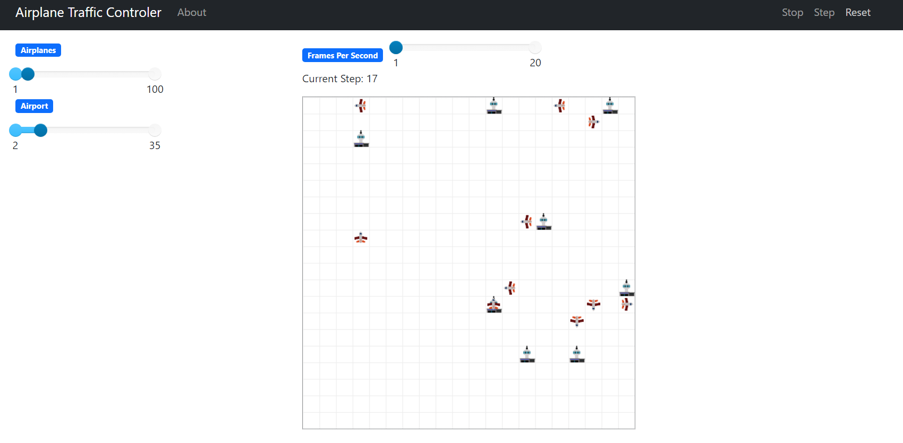
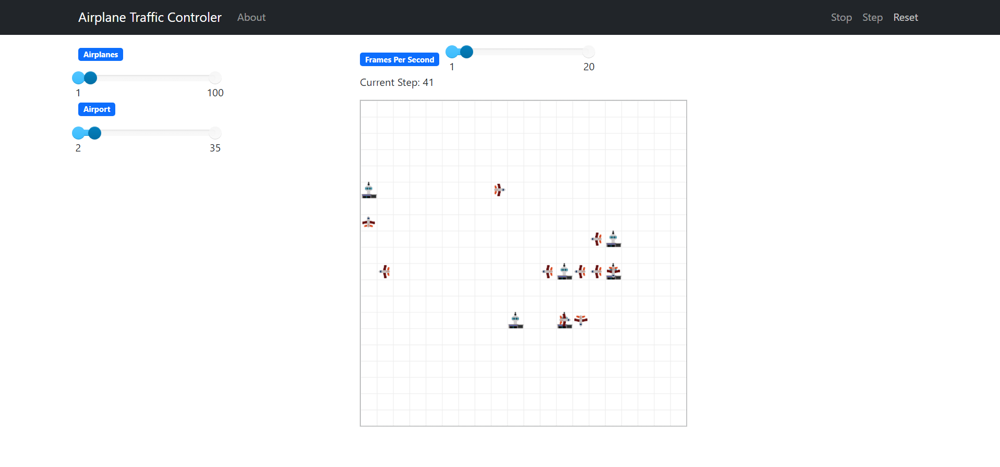
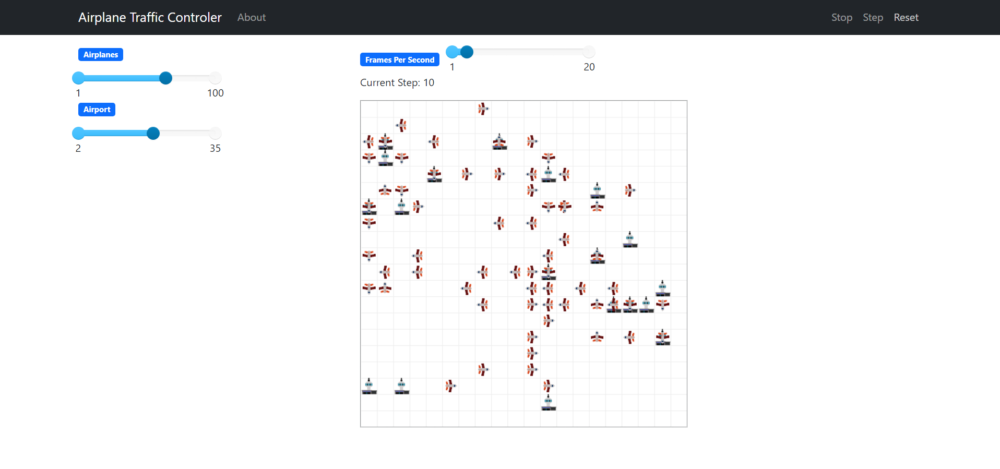

# 2023.2_G1_SMA_AirTrafficControl


**Disciplina**: FGA0210 - PARADIGMAS DE PROGRAMAÇÃO - T01 <br>
**Nro do Grupo (de acordo com a Planilha de Divisão dos Grupos)**: 01<br>
**Paradigma**:  SMA<br>

## Alunos
|Matrícula | Aluno |
| -- | -- |
| 18/0016067  |  Erick Levy Barbosa dos Santos |
| 20/0073249  |  Pedro Vitor Augusto de Jesus |
| 18/0011472  |  Rodolfo Cabral Neves |
| 18/0027352  |  Rodrigo Carvalho dos Santos |


## Sobre 
<p align='justify'>
O projeto AirTrafficControl é uma iniciativa que utiliza sistemas multiagentes para modelar e implementar o funcionamento de aeroportos, onde cada avião é tratado como um agente independente, planejando sua rota até o destino, que é o aeroporto. Cada comportamento, tanto do aeroporto quanto dos aviões, é baseado em Sistemas Multiagentes (SMA).</p> 


## Screenshots





## Instalação 

**Linguagens**: Python<br>

## Uso 

**É necessário ter o Python instalado para utilizar as dependências**

### Como Executar
```bash
    pip install -r requirements.tx
```
```bash
    cd/src
```
```bash
    python server.py
```

### Como Utilizar com ambiente virtual python
```bash
    python -m venv venv
```
```bash
    source venv/bin/activate
```
```bash
    pip install -r requirements.txt
```
```bash
    cd/src
```
```bash
    python server.py
```

Caso contrário digite qualquer outra coisa finalizando com o caractere de ponto.

## Vídeo de apresentação

Gravação futuramente

## Participações
Apresente, brevemente, como cada membro do grupo contribuiu para o projeto.
|Nome do Membro | Contribuição | Significância da Contribuição para o Projeto (Excelente/Boa/Regular/Ruim/Nula) |
| -- | -- | -- |
| Erick Levy Barbosa dos Santos     | No paradigma de multiagentes, aprendi como utilizar o Jade e o Mesa. Também estudei sobre o projeto, desenvolvendo a lógica de colisões e criando sprites para o avião e a base do aeroporto para rodar no software Mesa. Fiquei surpreso com a versatilidade do paradigma de multiagentes e gostei muito dessa abordagem. | Excelente |
| Pedro Vitor Augusto de Jesus      | No âmbito do projeto centrado no paradigma multiagente, minha contribuição envolveu a definição da estrutura dos agentes para o ambiente aeroportuário e aeronaves. Além disso, liderei a implementação dos métodos do servidor que foram essenciais para a inicialização do sistema. Desenvolvi a estrutura fundamental que determina as dimensões da projeção e a quantidade de agentes. Participei ativamente na otimização do comportamento das aeronaves, garantindo que não permanecessem paradas nos aeroportos após a chegada, implementando a lógica de seleção do próximo destino e gerenciando a interação das aeronaves parceladas. | Excelente|
| Rodolfo Cabral Neves              | Na entrega do paradigma de multiagentes, eu  escrevi um algoritmo guloso que calcula a menor rota do ponto de partida ao aeroporto desejado. Escrevi também a instrução que seleciona os aeroportos de destino de uma forma aleatória. | Excelente |
| Rodrigo Carvalho dos Santos       | Na entrega do paradigma de multiagentes, eu procurei por projetos similares ao proposto pelo Pedro, encontrei o projeto em SPADE e fiz o fork deste repositório, embora não utilizado, eu busquei rodar projeto, infelizmente sem sucesso, mesmo rodando a interface, estava estático e não mostrava os aviões realizando o percurso, ou alterava os passos. Ao migrar para o MESA, eu modularizei o projeto as pastas de agents e models, além de melhorar o algoritmo de encotrar o caminho e resolver a possível colisão com desvio de rota. | Excelente |

## Outros

### Lições Aprendidas

- **Sistema Multiagentes (SMA):** A principal conclusão do estudo é que o paradigma de Sistemas Multiagentes (SMA) foi aplicado com sucesso no desenvolvimento de uma simulação de controle aereo. A utilização de SMA possibilitou a modelagem de agentes autônomos interativos, o que foi importante para o desenvolvimento de sistemas de controle aéreo.


### Fragilidades

- **Curva de Aprendizado do SMA:** A adaptação ao paradigma de Sistemas Multiagentes exigiu um esforço considerável por parte da equipe de desenvolvimento. A compreensão das interações e dinâmicas entre os agentes, assim como a implementação eficaz das estratégias, demandou tempo e ajustes para alcançar um domínio satisfatório dessa abordagem.

- **Concorrência de Projetos Acadêmicos:** Uma limitação significativa surgiu devido à concorrência de tempo causada pelos projetos acadêmicos de outras disciplinas no final do semestre. As demandas adicionais provenientes de diferentes disciplinas na faculdade impactaram a disponibilidade da equipe, dificultando a dedicação integral ao desenvolvimento.


### Possíveis Melhorias

- **Melhorias na Lógica de Colisão:** A lógica de colisão pode ser otimizada para evitar duplicação de código e torná-la mais eficiente.

## Video apresentação

https://www.youtube.com/watch?v=3jbTe8YQijg

## Fontes


> Interface gráfica (Mesa): https://mesa.readthedocs.io/en/stable/;

> Mesa exmplos (Mesa): https://github.com/projectmesa/mesa-examples/;

> Linguagem de programação: https://www.python.org/;


